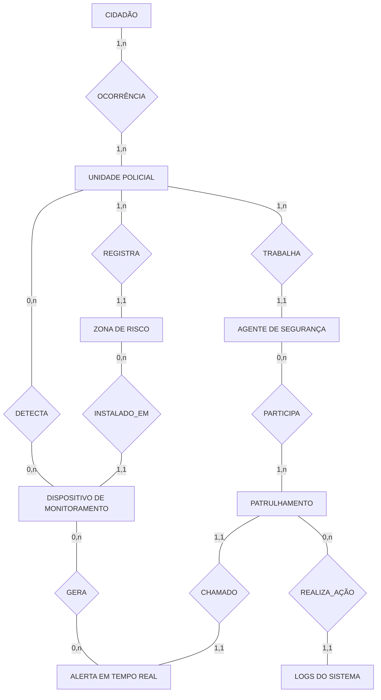

# 🛡️ Modelo Conceitual - Sistema de Segurança Pública

Este repositório contém a modelagem conceitual de um banco de dados voltado para **Segurança Pública e Monitoramento Urbano**. O objetivo é estruturar as informações referentes a unidades policiais, agentes, monitoramento em tempo real via dispositivos IoT e atendimento a ocorrências.

## 📊 Diagrama Conceitual

O gráfico abaixo representa o **Modelo Entidade-Relacionamento (MER)** do sistema, detalhando as entidades e suas interações.

**🗂️ Dicionário de Dados**

Abaixo segue a descrição das principais entidades modeladas neste sistema:

**🏢 Estrutura Policial**
UNIDADE POLICIAL: Representa as delegacias ou batalhões responsáveis por uma área de atuação.
AGENTE DE SEGURANÇA: Os policiais ou oficiais vinculados a uma unidade.
PATRULHAMENTO: A ação tática realizada pelos agentes (rondas) utilizando viaturas.

**🚨 Monitoramento e Ocorrências**
CIDADÃO: Pessoa física que registra ocorrências ou solicita ajuda.
OCORRÊNCIA: O evento registrado que vincula o cidadão à unidade policial responsável.
ZONA DE RISCO: Áreas geográficas mapeadas que necessitam de atenção especial.

**📡 Tecnologia e IoT**
DISPOSITIVO DE MONITORAMENTO: Câmeras, sensores ou equipamentos instalados nas zonas de risco.
ALERTA EM TEMPO REAL: Notificações geradas automaticamente pelos dispositivos quando algo anômalo é detectado. Estes alertas podem gerar um chamado para um patrulhamento ativo.

**⚙️ Auditoria**
LOGS DO SISTEMA: Registro de auditoria das ações realizadas durante um patrulhamento ou no sistema em geral, garantindo rastreabilidade.

**🔄 Regras de Negócio Principais**
Um Cidadão registra uma ocorrência que é atendida por uma Unidade Policial.
A Unidade Policial possui Agentes e gerencia Zonas de Risco.
Nas Zonas de Risco são instalados Dispositivos de Monitoramento.
Esses dispositivos podem gerar Alertas em Tempo Real.
Um Patrulhamento (composto por agentes) pode ser acionado para atender a um Alerta.

**🛠️ Tecnologias Utilizadas**
Mermaid.js: Para geração do diagrama visual diretamente no Markdown.
Modelagem de Dados: Conceito de Modelo Entidade-Relacionamento (MER).
Desenvolvido para fins de estudo em modelagem de banco de dados.
